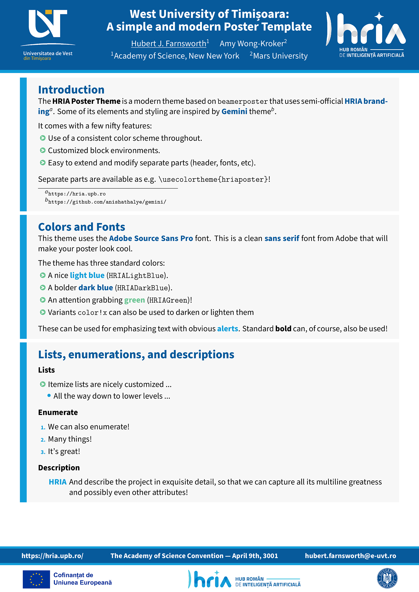

# HRIA Poster

[](https://github.com/alexfikl/hria-poster/actions/workflows/ci.yml)
[](https://www.overleaf.com/docs?snip_uri=https://github.com/alexfikl/hria-poster/archive/refs/heads/main.zip)

> [!WARNING]
> This was made for a HRIA workshop and is not a general poster. If you have
> use for a more flexible conference poster, feel free to reach out! Also,
> suggestions for modifying this towards a more official styling is very welcome.

This is an unofficial poster template for the [HRIA project](https://hria.upb.ro/)
with some logos specifically for the West University of Timișoara.

## How it looks like



## How to use it

To use the theme, you'll need the two `sty` files and the logos from the `assets`
folder. The `template.tex` file gives an example of how to use the theme itself.
In general, you should just need to add something like
```tex
\usetheme{hriaposter}
```
to your file and then create a Beamer `frame` to put your contents in. The
template uses Beamer blocks for the content, but this is not required, so feel
free to freestyle it more!

Some things to keep in mind:
* The paper size and orientation can be passed directly in the `\usetheme` call.
  (see `template.tex`)
* The font should be modified with e.g. `scale=1.25` in the `\usetheme` call.
  This will uniformly increase the fonts by 25%, so that all the different headings
  maintain their distinctive sizes.
* This uses the `sourcesanspro` (Adobe Source Sans Pro) font, for which you'll
  likely need `texlive-fontsextra` (depending on your installation).

## Documentation

The package defines the following options used as `\usetheme[opts]{hriaposter}`.

| Option                            | Description                           |
| :-                                | :-                                    |
| `showframe`                       | Shows a frame around page elements (margins, etc.) |
| `layoutgrid`                      | Adds a debug grid to check alignment  |
| other                             | Other options are passed to `beamerposter` |

As mentioned, other options are passed directly to the underlying
`beamerposter` package, so we recommend reading its
[documentation](https://ctan.org/pkg/beamerposter?lang=en).

The following helper macros are defined for some standard functionality.

| Macro                             | Description                           |
| :-                                | :-                                    |
| `\footerleft`                     | Generic text to add on the left of the footer |
| `\footermiddle`                   | Generic text to add on the middle of the footer |
| `\footerright`                    | Generic text to add on the right of the footer |
| `\footerweb`                      | Personal or institutional website (on the left) |
| `\footerlocation`                 | Location of the poster presentation (in the middle) |
| `\footeremail`                    | Contact email (on the right)          |
| `\footername`                     | Presenter or institution name (on the right) |
| `\heading`                        | A macro that adds a small heading inside blocks |
| `\separatorcolumn`                | Adds a standardized spacing between columns |
| `\headerlogoleft`                 | Left-hand side logo in the header     |
| `\headerlogoright`                | Right-hand side logo in the header     |

The theme also defines the following colors, if you want to make use of them
elsewhere, for consistency.

| Color             | RGB
| :-                | :-
| `HRIALightBlue`   |  `(15, 157, 217)` |
| `HRIADarkBlue`    |  `(7, 90, 155)`   |
| `HRIAGreen`       |  `(107, 195, 217)` |
| `HRIAPurple`      |  `(115, 44, 144)` |

## Acknowledgement

This theme is based on the [UVT Conference Poster Theme](https://github.com/alexfikl/uvt-poster),
which was in turn based on the [Gemini Theme](https://github.com/anishathalye/gemini/).
If you need a more general theme, Gemini is quite wonderful!

# License

Creative Commons Attribution 4.0 International
